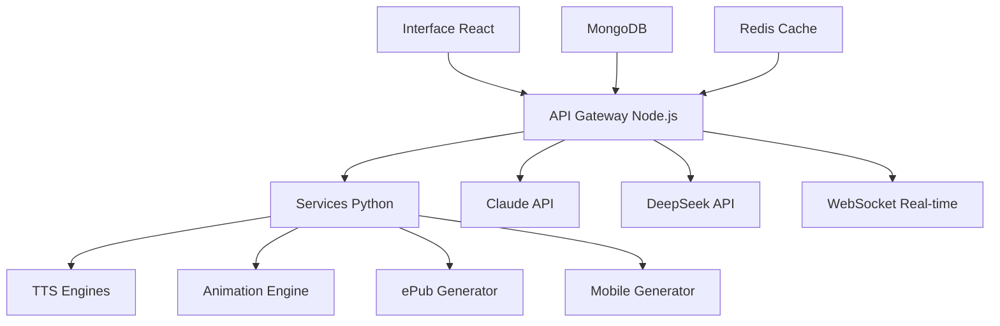

# 🌟 PLATEFORME IA INTERACTIVE - DOCUMENTATION COMPLÈTE

## 🎯 **VISION DU PROJET**

La **Plateforme IA Interactive** est un écosystème complet de génération de contenu multimédia intelligent, combinant les capacités avancées de **Claude 4**, **DeepSeek**, et des technologies d'animation/audio de pointe pour créer des expériences interactives immersives.

### **🚀 Objectifs Principaux**

- **💬 Conversation IA Avancée** : Interface chat multi-modale avec Claude et DeepSeek
- **📖 Génération ePub3 Enrichi** : Livres interactifs avec animations et narration
- **📱 Applications Mobiles** : Apps React Native générées automatiquement
- **🎬 Animations Synchronisées** : Lottie + CSS + Timeline audio
- **🔊 Narration Synthétique** : TTS multi-provider haute qualité
- **🌐 Déploiement Production** : Infrastructure scalable et monitorée

---

## 🏗️ **ARCHITECTURE TECHNIQUE DÉTAILLÉE**

### **Stack Technologique**

#### **Frontend**

- **React 18** + Hooks + Context API
- **Tailwind CSS** + Animations CSS personnalisées
- **PWA** (Progressive Web App)
- **WebSockets** pour le temps réel
- **Lottie** + **Framer Motion** pour animations

#### **Backend**
- **Node.js 18** + **Express** + **TypeScript**
- **WebSockets** (Socket.io) + **Rate Limiting**
- **Redis** pour cache et sessions
- **MongoDB** pour persistance
- **JWT** + **Helmet** pour sécurité

#### **Services Python**
- **FastAPI** + **Pydantic** + **AsyncIO**
- **Librosa** pour analyse audio
- **Pillow** pour traitement d'images
- **aiohttp** pour clients HTTP async

#### **Intégrations IA**
- **Claude API** (Anthropic) - Chat principal
- **DeepSeek API** - Code et tâches techniques
- **ElevenLabs** - TTS premium
- **Azure Speech** - TTS fallback
- **OpenAI TTS** - TTS standard

#### **Infrastructure**
- **Docker** + **Docker Compose**
- **Kubernetes** pour production
- **Nginx** reverse proxy + SSL
- **Prometheus** + **Grafana** monitoring
- **Loki** pour logs centralisés

### **Flux de Données**



---

## 🎨 **FONCTIONNALITÉS PRINCIPALES**

### **1. Interface Chat Multimodale**

#### **Modes de Conversation**
- **💬 Chat Général** : Conversation ouverte avec Claude
- **📄 Analyse Documents** : Upload + analyse intelligent
- **💻 Génération Code** : Développement assisté par IA
- **🔊 Narration Audio** : Scripts + synthèse vocale

#### **Fonctionnalités Avancées**
- **Historique persistant** avec recherche
- **Export conversations** (JSON, Markdown, TXT)
- **Thèmes adaptatifs** (clair/sombre)
- **Indicateurs temps réel** (frappe, connexion)
- **Retry automatique** avec backoff exponentiel

### **2. Système d'Animation Interactif**

#### **Types d'Animations Supportés**
- **Lottie** : Animations After Effects exportées
- **CSS Animations** : Keyframes personnalisées
- **Framer Motion** : Animations React déclaratives
- **Mixtes** : Combinaisons synchronisées

#### **Éditeur d'Animation**
- **Timeline interactive** avec markers
- **Propriétés en temps réel** (durée, easing, etc.)
- **Prévisualisation live**
- **Export multi-format** (Web, Mobile, ePub)
- **Synchronisation audio** automatique

#### **Exemples d'Animations**
```javascript
// Animation Lottie simple
const fadeInAnimation = {
  type: 'lottie',
  elements: [
    {
      type: 'text',
      text: 'Bienvenue !',
      animation: { type: 'fadeIn', duration: 2000 }
    }
  ]
};

// Animation CSS keyframes
const bounceAnimation = {
  type: 'css',
  keyframes: [
    { percentage: 0, properties: { transform: 'scale(1)' } },
    { percentage: 50, properties: { transform: 'scale(1.2)' } },
    { percentage: 100, properties: { transform: 'scale(1)' } }
  ],
  duration: 1000,
  easing: 'ease-in-out'
};
```

### **3. Synthèse Vocale Multi-Provider**

#### **Providers Supportés**
1. **ElevenLabs** - Qualité premium, voix naturelles
2. **Azure Speech** - 200+ voix, 60+ langues
3. **OpenAI TTS** - Rapide et économique
4. **Google Cloud TTS** - Intégration facile

#### **Fonctionnalités TTS**
- **Sélection automatique** du meilleur provider
- **Voix personnalisables** (vitesse, ton, style)
- **Synchronisation A/V** avec animations
- **Formats multiples** (MP3, WAV, OGG)
- **Streaming audio** en temps réel

#### **Exemple Usage TTS**
```javascript
const audioResult = await synthesizeSpeech(
  "Bonjour ! Cette histoire va commencer dans 3, 2, 1...",
  {
    voice: 'nova',
    language: 'fr',
    speed: 1.1,
    style: 'storytelling',
    quality: 'high'
  }
);
```

### **4. Générateur ePub3 Interactif**

#### **Caractéristiques ePub3**
- **HTML5 + CSS3** interactif
- **Animations Lottie** intégrées
- **Audio synchronisé** avec texte
- **Navigation enrichie** avec chapitres
- **Responsive design** multi-device
- **Thèmes adaptatifs** jour/nuit

#### **Structure ePub Générée**
```
📖 MonLivre.epub
├── mimetype
├── META-INF/
│   └── container.xml
└── OEBPS/
    ├── content.opf
    ├── nav.xhtml
    ├── styles/
    │   └── main.css (animations incluses)
    ├── js/
    │   └── interactions.js
    ├── audio/
    │   └── chapter1.mp3
    ├── animations/
    │   └── intro.json (Lottie)
    └── chapters/
        ├── chapter1.xhtml
        └── chapter2.xhtml
```

#### **Exemple Chapitre Interactif**
```html
<div class="chapter animated fadeIn">
  <h1>Le Robot Explorateur</h1>
  
  <div class="animation-container">
    <div class="lottie-player" data-src="robot-intro.json"></div>
  </div>
  
  <p class="animated slideUp delay-1s">
    Dans un futur lointain, un petit robot nommé Zyx...
  </p>
  
  <audio controls class="chapter-audio" data-sync="true">
    <source src="chapter1-narration.mp3" type="audio/mpeg">
  </audio>
  
  <div class="interactive-quiz">
    <h3>Que pensez-vous du robot ?</h3>
    <button class="quiz-option" data-correct="true">Il est courageux</button>
    <button class="quiz-option">Il a peur</button>
  </div>
</div>
```

### **5. Génération d'Applications Mobiles**

#### **Stack Mobile**
- **React Native** + **Expo**
- **Navigation** avec React Navigation
- **Animations** avec Reanimated
- **Audio** avec expo-av
- **Stockage** avec AsyncStorage

#### **Fonctionnalités Mobiles**
- **Synchronisation offline/online**
- **Notifications push**
- **Capture documents** (OCR)
- **Interactions gestuelles**
- **Mode sombre adaptatif**

---

## 🔌 **API COMPLÈTE**

### **Endpoints Chat & IA**

#### **POST /api/chat/claude**
```javascript
{
  "message": "Raconte-moi une histoire de science-fiction",
  "mode": "chat",
  "options": {
    "maxTokens": 2000,
    "temperature": 0.8,
    "systemPrompt": "Tu es un conteur expert..."
  }
}

// Response
{
  "success": true,
  "content": "Dans les profondeurs de l'espace...",
  "usage": {
    "input_tokens": 25,
    "output_tokens": 1500
  },
  "metadata": {
    "model": "claude-3-sonnet-20240229",
    "processingTime": 2.3
  }
}
```

#### **POST /api/chat/deepseek**
```javascript
{
  "messages": [
    {"role": "user", "content": "Crée une fonction de tri en Python"},
    {"role": "assistant", "content": "Voici une fonction..."},
    {"role": "user", "content": "Optimise-la davantage"}
  ],
  "options": {
    "maxTokens": 1500,
    "temperature": 0.3
  }
}
```

### **Endpoints Multimédia**

#### **POST /api/tts/synthesize**
```javascript
{
  "text": "Chapitre 1 : L'aventure commence...",
  "voice": "nova",
  "language": "fr",
  "speed": 1.0,
  "format": "mp3",
  "quality": "high"
}

// Response
{
  "success": true,
  "audio_data": "base64_encoded_audio",
  "format": "mp3",
  "duration": 45.2,
  "file_size": 1048576,
  "metadata": {
    "provider": "elevenlabs",
    "voice_id": "pNInz6obpgDQGcFmaJgB"
  }
}
```

#### **POST /api/animations/generate**
```javascript
{
  "type": "lottie",
  "content": {
    "elements": [
      {
        "type": "text",
        "text": "Bienvenue !",
        "animation": {"type": "fadeIn"}
      }
    ]
  },
  "duration": 3000,
  "fps": 30
}
```

### **Endpoints Export**

#### **POST /api/export/epub**
```javascript
{
  "title": "Mon Histoire Interactive",
  "author": "IA Platform",
  "content": [
    {
      "type": "chapter",
      "title": "Chapitre 1",
      "content": "Il était une fois...",
      "animations": ["intro-animation.json"],
      "audio": "chapter1-narration.mp3"
    }
  ],
  "metadata": {
    "language": "fr",
    "description": "Une histoire générée par IA"
  }
}

// Response
{
  "success": true,
  "task_id": "epub_20240115_143022",
  "status": "processing",
  "estimated_time": "3-5 minutes"
}
```

#### **GET /api/export/epub/status/{task_id}**
```javascript
{
  "status": "completed",
  "progress": 100,
  "file_path": "/exports/epub_20240115_143022.epub",
  "file_size": 5242880,
  "download_url": "/api/export/epub/download/epub_20240115_143022"
}
```

---

## 🎯 **CAS D'USAGE AVANCÉS**

### **1. Création de Livre Jeunesse Interactif**

```javascript
// 1. Génération de l'histoire
const storyPrompt = `
Crée une histoire pour enfants de 5-8 ans sur un petit dragon qui apprend à voler.
L'histoire doit avoir :
- 3 chapitres courts
- Des moments d'émotion
- Une morale sur la persévérance
- Du vocabulaire adapté à l'âge
`;

const story = await apiClient.sendClaudeMessage(storyPrompt, 'chat');

// 2. Génération des animations
const animations = await Promise.all([
  apiClient.generateAnimation('lottie', {
    elements: [{ type: 'dragon', action: 'fly', style: 'cute' }]
  }),
  apiClient.generateAnimation('css', {
    type: 'sparkles',
    duration: 2000
  })
]);

// 3. Génération audio avec voix enfantine
const audio = await apiClient.synthesizeSpeech(story.content, {
  voice: 'nova',
  style: 'cheerful',
  speed: 0.9
});

// 4. Compilation en ePub3
const epub = await apiClient.generateEPub(
  "Dracky Apprend à Voler",
  "IA Créative",
  parseStoryChapters(story.content),
  animations,
  [audio.audio_data]
);

// 5. Génération app mobile
const mobileApp = await apiClient.generateMobileApp(
  "Dracky-App",
  parseStoryChapters(story.content),
  animations
);
```

### **2. Plateforme E-Learning Interactive**

```javascript
// Création de cours avec quiz interactifs
const courseContent = await apiClient.sendClaudeMessage(`
Crée un cours sur les bases de JavaScript avec :
- 5 leçons progressives
- Exemples de code pratiques
- Quiz de fin de chapitre
- Exercices interactifs
`, 'documents');

// Génération d'animations éducatives
const educationalAnimations = await apiClient.generateAnimation('mixed', {
  elements: [
    { type: 'code-highlight', language: 'javascript' },
    { type: 'concept-diagram', topic: 'variables' },
    { type: 'interactive-quiz', questions: 5 }
  ]
});

// Audio du cours avec voix pédagogique
const courseAudio = await apiClient.synthesizeSpeech(courseContent, {
  voice: 'onyx',
  style: 'educational',
  speed: 1.0
});
```

### **3. Présentation Business Interactive**

```javascript
// Génération de contenu professionnel
const presentation = await apiClient.sendClaudeMessage(`
Crée une présentation pour investisseurs sur notre startup IA :
- Executive summary
- Marché et opportunités
- Solution technique
- Business model
- Prévisions financières
- Call to action
`, 'code');

// Animations business (graphiques, transitions)
const businessAnimations = await apiClient.generateAnimation('lottie', {
  elements: [
    { type: 'chart', data: 'growth-curve' },
    { type: 'logo-reveal', style: 'professional' },
    { type: 'data-visualization', format: 'interactive' }
  ]
});

// Voix professionnelle pour narration
const presentationAudio = await apiClient.synthesizeSpeech(presentation, {
  voice: 'alloy',
  style: 'professional',
  emphasis: 'business'
});
```

---

## 📊 **MONITORING ET ANALYTICS**

### **Métriques Clés**

#### **Performance Système**
- **Response Time** : API < 2s, TTS < 10s
- **Throughput** : 1000 req/min par instance
- **Error Rate** : < 1% des requêtes
- **Uptime** : 99.9% SLA

#### **Utilisation IA**
- **Tokens Claude** : Consommation/coût par jour
- **Requêtes DeepSeek** : Volume et latence
- **Audio généré** : Minutes/mois, coût TTS
- **ePub créés** : Nombre et taille moyenne

#### **Engagement Utilisateur**
- **Sessions actives** : Utilisateurs simultanés
- **Durée moyenne** : Temps par session
- **Actions populaires** : Modes les plus utilisés
- **Taux de conversion** : Chat → Export

### **Dashboards Grafana**

#### **Dashboard Système**
```yaml
Panels:
  - CPU/Memory Usage par service
  - Requêtes/sec par endpoint
  - Error rates et alerts
  - Database connections
  - Cache hit rates
```

#### **Dashboard Business**
```yaml
Panels:
  - Utilisateurs actifs (jour/semaine/mois)
  - Revenus et coûts API
  - Conversions par funnel
  - Satisfaction utilisateur
  - Adoption de fonctionnalités
```

---

## 🔒 **SÉCURITÉ ET CONFORMITÉ**

### **Mesures de Sécurité**

#### **Authentication & Authorization**
- **JWT Tokens** avec expiration
- **Rate Limiting** par utilisateur/IP
- **API Keys** chiffrées en base
- **RBAC** (Role-Based Access Control)

#### **Protection des Données**
- **Chiffrement** AES-256 au repos
- **HTTPS/TLS 1.3** en transit
- **Anonymisation** des logs
- **Backup chiffré** automatique

#### **Conformité**
- **RGPD** : Droit à l'oubli, portabilité
- **SOC 2** : Audits de sécurité
- **ISO 27001** : Management sécurité
- **Privacy by Design**

### **Audit et Logs**

```javascript
// Structure de log sécurisé
{
  "timestamp": "2024-01-15T10:30:00Z",
  "level": "INFO",
  "service": "api",
  "user_id": "hashed_user_id",
  "action": "chat_request",
  "endpoint": "/api/chat/claude",
  "response_time": 1.23,
  "status": 200,
  "ip": "xxx.xxx.xxx.xxx",
  "user_agent": "hashed_ua",
  "request_id": "req_123456789"
}
```

---

## 🚀 **ROADMAP ET ÉVOLUTIONS**

### **Version 2.0 (Q2 2024)**
- 🎥 **Génération vidéo** avec AI
- 🌍 **Multi-langues** (20+ langues)
- 🤝 **Collaboration temps réel**
- 📈 **Analytics avancées**
- 🔌 **API publique** pour développeurs

### **Version 3.0 (Q4 2024)**
- 🧠 **Fine-tuning** de modèles
- 🎮 **Contenu interactif** (jeux, VR)
- 🏢 **Version Enterprise**
- 🔄 **Intégrations** (Slack, Teams, Notion)
- 📱 **Apps natives** iOS/Android

### **Vision Long Terme**
- 🤖 **Agents IA autonomes**
- 🌐 **Marketplace** de contenu
- 🎓 **Plateforme éducative**
- 🏭 **Solution B2B** complète

---

## 👥 **ÉQUIPE ET CONTRIBUTION**

### **Core Team**
- **Lead Developer** : Architecture et backend
- **Frontend Specialist** : React et UX/UI
- **AI Engineer** : Intégrations IA et ML
- **DevOps Engineer** : Infrastructure et déploiement

### **Contribution Guidelines**

#### **Code Standards**
- **ESLint** + **Prettier** pour JavaScript
- **Black** + **isort** pour Python
- **Conventional Commits**
- **Tests coverage > 80%**

#### **Process**
1. **Fork** le repository
2. **Branch** feature/bugfix
3. **Development** + tests
4. **Pull Request** avec description
5. **Code Review** par l'équipe
6. **Merge** après approbation

### **License**
MIT License - Open Source avec attribution

---

## 📞 **RESSOURCES ET SUPPORT**

### **Documentation Technique**
- **API Reference** : `/docs/api/`
- **SDK Documentation** : `/docs/sdk/`
- **Architecture Guide** : `/docs/architecture/`
- **Deployment Guide** : `/docs/deployment/`

### **Exemples et Tutoriels**
- **Getting Started** : `/examples/basic/`
- **Advanced Use Cases** : `/examples/advanced/`
- **Video Tutorials** : YouTube Channel
- **Blog Posts** : Medium Publication

### **Support Communauté**
- **GitHub Issues** : Bug reports et features
- **Discord Server** : Chat en temps réel
- **Stack Overflow** : Tag `ai-interactive-platform`
- **Reddit** : r/AIInteractivePlatform

### **Support Enterprise**
- **Email** : enterprise@aiplatform.com
- **Slack Connect** : Support dédié
- **Phone Support** : 24/7 pour clients premium
- **Custom Development** : Services professionnels

---

## 🎉 **CONCLUSION**

La **Plateforme IA Interactive** représente l'avenir de la création de contenu multimédia intelligent. En combinant les dernières avancées en IA conversationnelle, synthèse vocale, et animations interactives, elle offre un environnement complet pour créer des expériences immersives de nouvelle génération.

### **Valeur Ajoutée Unique**
- **🚀 Innovation** : Technologies IA de pointe
- **🎨 Créativité** : Outils de création intuitifs
- **📱 Multi-platform** : Web, Mobile, ePub3
- **⚡ Performance** : Architecture scalable
- **🔒 Sécurité** : Standards enterprise
- **🌍 Accessibilité** : Interface inclusive

### **Impact Attendu**
- **Démocratisation** de la création de contenu
- **Accélération** des workflows créatifs
- **Amélioration** de l'engagement utilisateur
- **Réduction** des coûts de production
- **Innovation** dans l'éducation et la formation

**Ensemble, créons l'avenir du contenu interactif ! 🚀✨**
